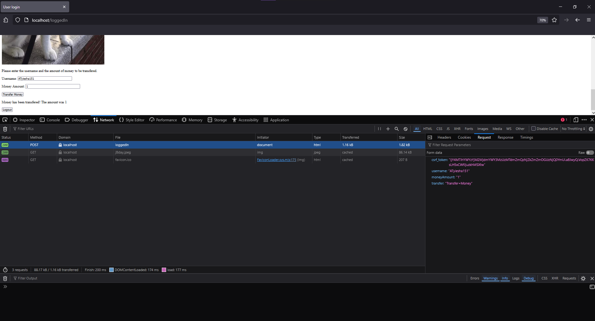
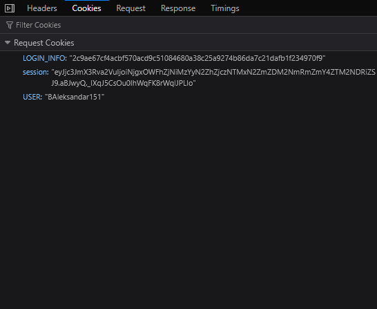

## Question 1A - Find cookies in the browser UI
We can transfer some money using the bank site and check the network tab of the inspect function on Mozilla Firefox. There we can find headers, request, response, and cookies.

## Question 1B - Set cookies
We import the request instance variable and the make_response method to create responses we can set cookies to. Cookie Q1B2 is limited to one endpoint by setting the argument path='/Q1B2'. Cookie Q1B3 is more secure because we set http_only and secure to true to prevent cross-site tampering.

<video controls src="Q1-1.mp4" title="Title"></video>

## Question 2 - CSRF attack
In this attack we automatically submit a form when a user enters our site via a HTML form that targets a hidden inline frame. The inline frame (iframe) silently loads and requests from the bank site and we send the money from the victim users logged in account to our account. Meanwhile, the supposed victim is none the wiser as the form is hidden and no pop-up appears because the iframe has no display.

<video controls src="Q2.mp4" title="Q2vid"></video>

## Question 3 - XSS attack
We can test if a form is vulnerable to an XSS attack by attempting to inject a script in the box and submitting.  If the form is vulnerable to an XSS attack, it will give us an alert when it is interpreted as code. Then we can use the script '' to find the cookie value.

<video controls src="Q3.mp4" title="Q3vid"></video>

## Question 4 - XSS Backdoor
In this attack we brute force codes 000-999 for a backdoor, or a key disables santization on the form and allows us to inject a script. 

<video controls src="Q4.mp4" title="Q4vid"></video>